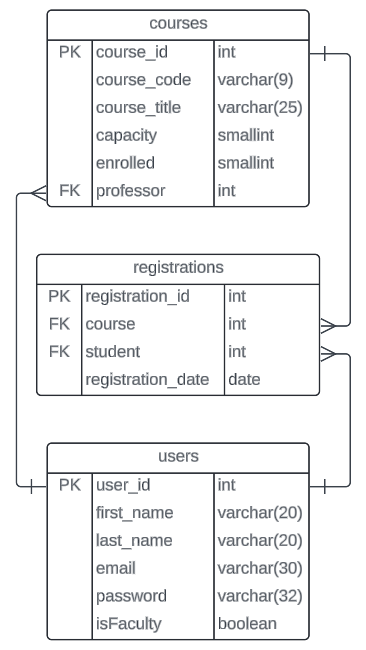

# david_jeske_p0

A Course Registration System for both students and faculty.

## User Stories

As any kind of user, I can:

-   [x] login with my existing credentials

### As a faculty member I can:

-   [x] add new classes to the registration catalog
-   [x] change the registration details for a class
-   [x] remove a class from the registration catalog (this should unregister all registered students)

### As a student, I can:

-   [x] register a new account with the system (must be secured with a password)
-   [x] view classes available for registration
-   [x] register for an open and available class
-   [x] cancel my registration for a class (if within window)
-   [x] view the classes that I have registered for

### Known Issues:

- Any student can delete any registration
- Most creation methods will just throw PSQLExceptions if you break any unique constraints
- Many missing http responses/results 
- Testing... completely broken